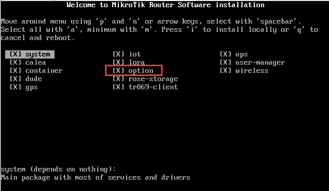
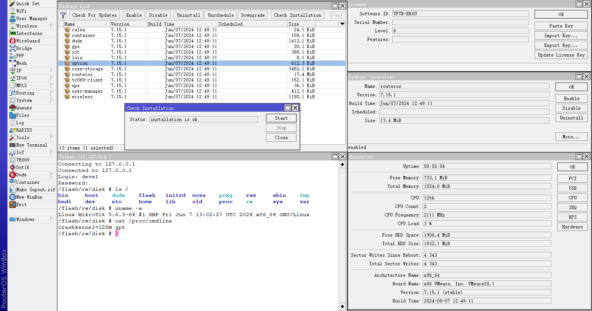
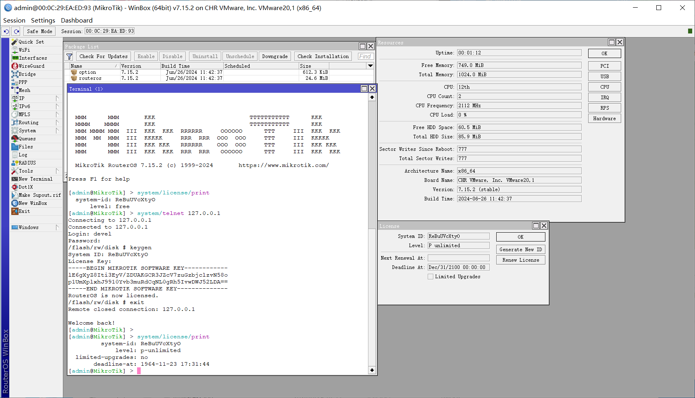

# Patch MikroTik RouterOS [[中文](README_CN.md)]

### [[Discord](https://discord.gg/keV6MWQFtX)] [[Telegram](https://t.me/+99Mw06p3K7NlMmNl)]

### Download [Latest Patched](https://github.com/elseif/MikroTikPatch/releases/latest) iso file,install it and enjoy.
### CHR image is both support BIOS and UEFI boot mode.

### Uses keygen to generate license key.

## How generate license key (***keygen.exe run on windows***)
    keygen.zip in iso or img root directory,for chr image it's in /flash/rw/disk/ directory,same as winbox file manager directory
    run unzip keygen.zip
    run keygen.exe
    input your software id
## How to use shell
    install option-{version}.npk package
    run telnet to routeros with username devel and password is same as admin
## How to use python3
    install python3-{version}.npk package
    run telnet to routeros with username devel and password is same as admin
    run python -V
## How Covert x86 and Chr (Chr mode could auto resize disk)
    to Chr,run this command in shell
    echo -e "\x01" | dd of=/dev/sda bs=1 count=1 seek=336 conv=notrunc
    to x86,run this command in shell
    echo -e "\x00" | dd of=/dev/sda bs=1 count=1 seek=336 conv=notrunc
    if you want to resize disk,convert to chr first,then resize disk and convert to x86
### npk.py
    Sign，Verify，Create, Extract npk file.
### patch.py
    Patch public key and sign NPK files
### netinstall.py
    Modify netinstallexe to enable network installation of NPK files that have been resigned in ISO
### upgrade.py
    By adding static domain name resolution in RouterOS, the NPK file that has been resigned in ISO can be installed during the upgrade process.
## all patches are applied automatically with [Github Action](https://github.com/elseif/MikroTikPatch/blob/main/.github/workflows/mikrotik_patch.yml).

