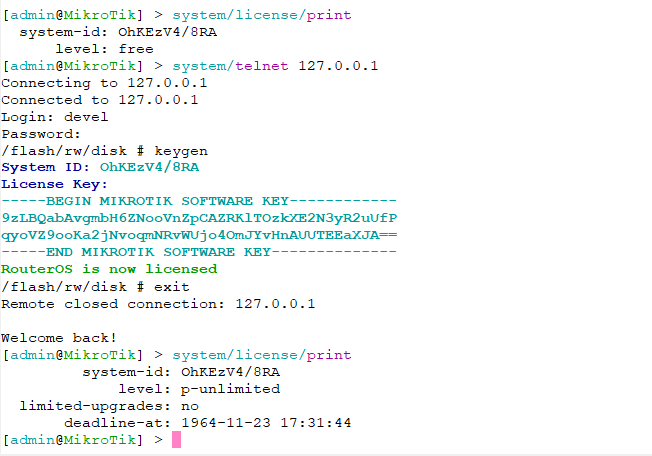

# Patch MikroTik RouterOS [[中文](README_CN.md)]

### [[Discord](https://discord.gg/keV6MWQFtX)] [[Telegram](https://t.me/+99Mw06p3K7NlMmNl)]

### Download [Latest Patched](https://github.com/elseif/MikroTikPatch/releases/latest) iso file,install it and enjoy.
### CHR image is both support BIOS and UEFI boot mode.

### license RouterOS for x86.

### license RouterOS for chr.

## How to use shell
    install option-{version}.npk package
    run telnet to routeros with username devel and password is same as admin
## How to license RouterOS
    telnet to routeros with username devel and password is same as admin
    run keygen
## How to use python3
    install python3-{version}.npk package
    run telnet to routeros with username devel and password is same as admin
    run python -V
### npk.py
    Sign，Verify，Create, Extract npk file.
### patch.py
    Patch public key and sign NPK files
### netinstall.py
    Modify netinstallexe to enable network installation of NPK files that have been resigned in ISO
### upgrade.py
    By adding static domain name resolution in RouterOS, the NPK file that has been resigned in ISO can be installed during the upgrade process.
## all patches are applied automatically with [Github Action](https://github.com/elseif/MikroTikPatch/blob/main/.github/workflows/mikrotik_patch.yml).

