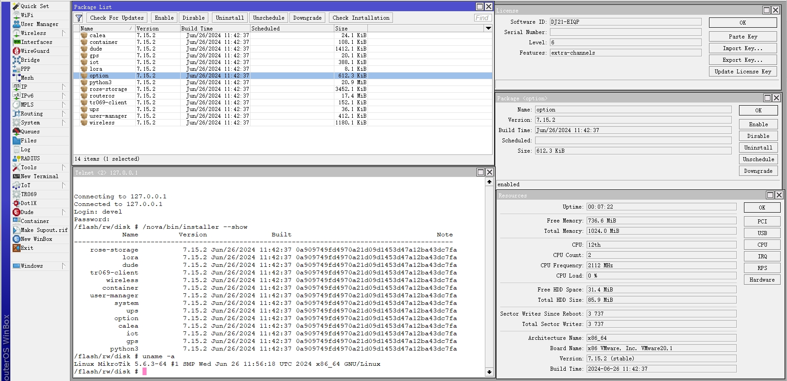
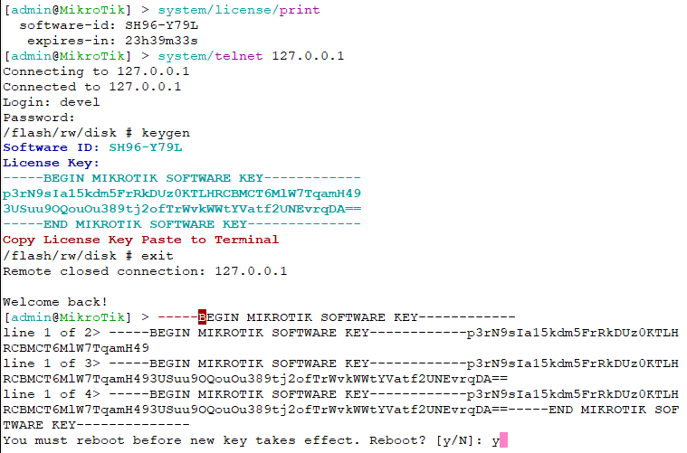
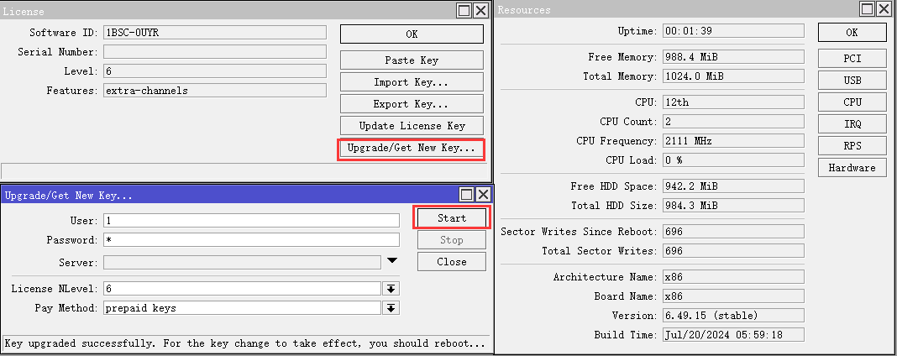
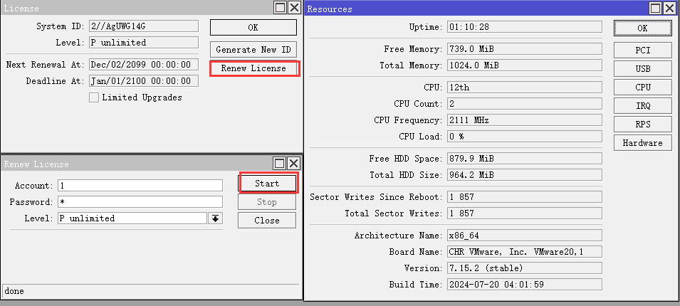
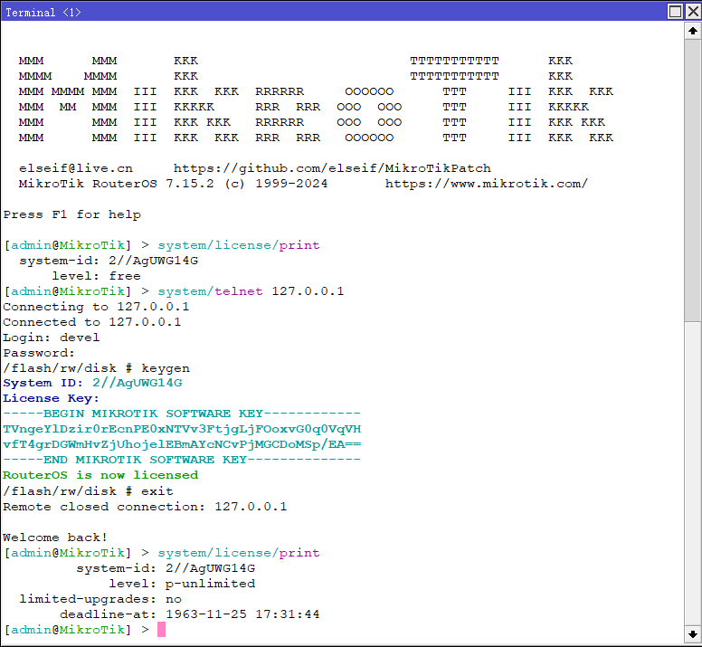
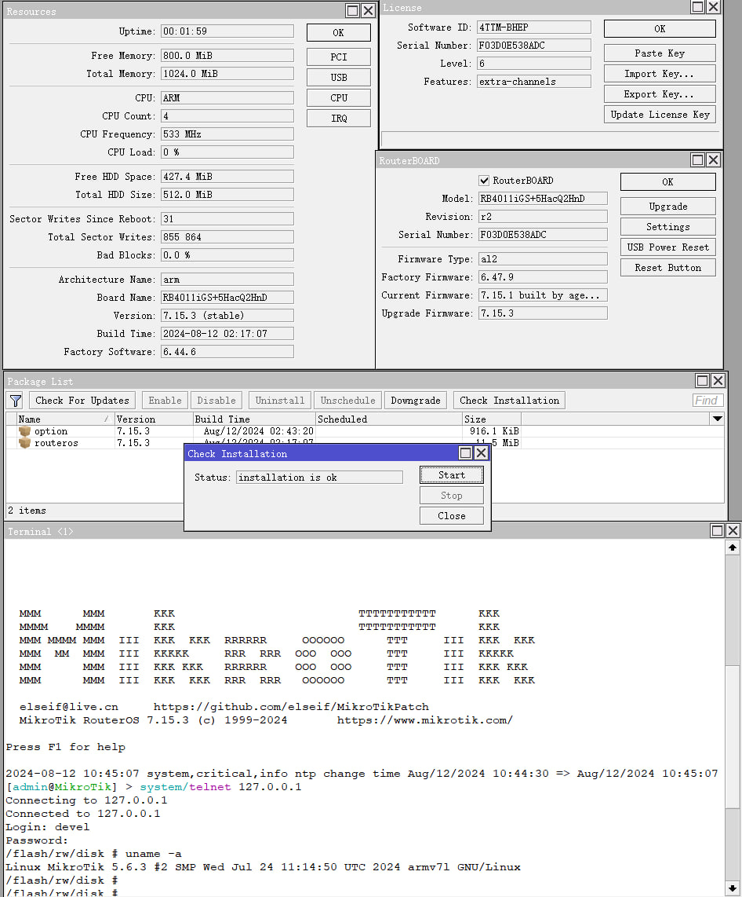
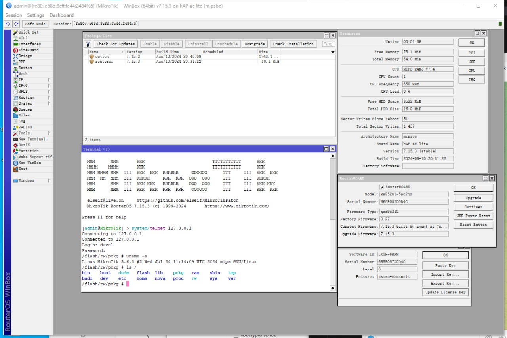

# MikroTik RouterOS Patch  [[English](README_EN.md)]

### [[Discord](https://discord.gg/keV6MWQFtX)] [[Telegram](https://t.me/mikrotikpatch)] [[Keygen(Telegram Bot)](https://t.me/ROS_Keygen_Bot)]

### 国内镜像下载 密码: elseif
[ [123pan](https://www.123pan.com/s/IpxgTd-BYjQh.html) ]
[ [7.15.3](https://elseif.lanzouj.com/b00cre7g7a)]
[ [7.15.3-arm64](https://elseif.lanzouj.com/b00cre7g8b) ] 
[ [6.49.15](https://elseif.lanzouj.com/b00crdq4ji) ] 
[ [6.49.13](https://elseif.lanzouj.com/b00crdq4kj) ]       

支持:在线更新、在线授权、云备份、DDNS

### x86模式授权许可

### x86模式在线授权(v6.x)

### Chr模式在线授权

### Chr模式授权许可

## 如何使用Shell
    安装 option-{version}.npk 包
    telnet到RouterOS,用户名devel,密码与admin的密码相同
## 如何授权许可
    进入shell
    运行 keygen
    参考上图。
    Chr镜像支持在线授权许可
## 如何使用Python
    安装 python3-{version}.npk 包
    telnet到RouterOS,用户名devel,密码与admin的密码相同
    运行 python -V
### npk.py
    对npk文件进行解包，修改，创建，签名和验证
### patch.py
    替换公钥并签名

## 所有的修补操作都自动运行在[Github Action](https://github.com/elseif/MikroTikPatch/blob/main/.github/workflows/)。

