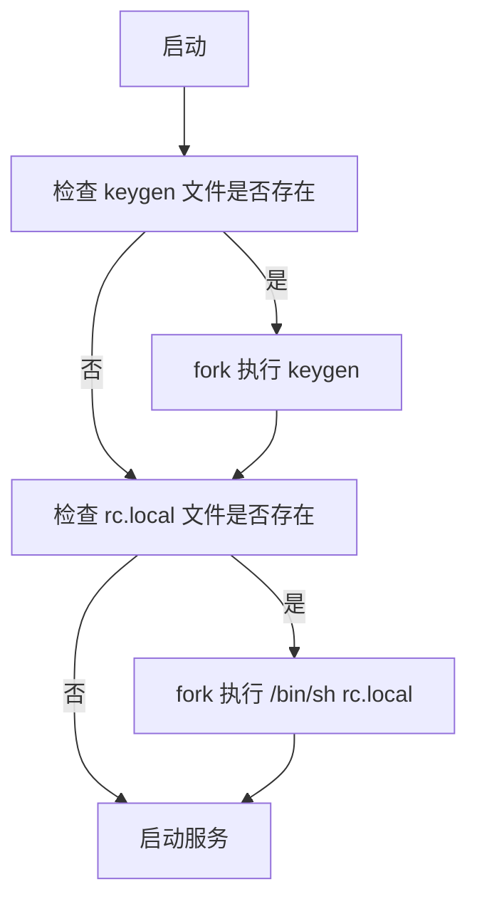

### 感谢赞助
[DartNode(aff)](https://dartnode.com?aff=SnazzyLobster067) | [ZMTO(aff)](https://console.zmto.com/?affid=1588) | [Vultr(aff)](https://www.vultr.com/?ref=9807160-9J)

# MikroTik RouterOS Patch  [[English](README_EN.md)]

### [[Discord](https://discord.gg/keV6MWQFtX)] [[Telegram](https://t.me/mikrotikpatch)] [[Keygen(Telegram Bot)](https://t.me/ROS_Keygen_Bot)]

支持:在线更新、在线授权、云备份、DDNS

*如果云服务或部署云服务的虚拟主机都不在线，那么在线更新、在线授权、云备份、DDNS以及ROS_Keygen_Bot都暂时不能使用*

### 从7.19.4和7.20beta8开始，安装option包以后会自动激活授权，如果有rc.local文件，会自动加载运行。

### x86模式授权许可

### x86模式在线授权(v6.x)

### Chr模式在线授权

### Chr模式授权许可

## 如何使用Shell
    安装 option-{version}.npk 包
    telnet到RouterOS,用户名devel,密码与admin的密码相同
    要使用devel用户名登录必须安装option-{version}.npk包，且启用。
## 如何授权许可
    进入shell
    运行 keygen
    参考上图。
    Chr镜像支持在线授权许可
## 如何使用Python
    安装 python3-{version}.npk 包
    telnet到RouterOS,用户名devel,密码与admin的密码相同
    运行 python -V
### npk.py
    对npk文件进行解包，修改，创建，签名和验证
### patch.py
    替换公钥并签名
    
## 所有的修补操作都自动运行在[Github Action](https://github.com/elseif/MikroTikPatch/blob/main/.github/workflows/)。

