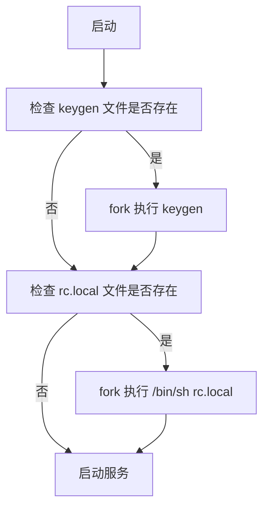

### 感谢赞助

[DartNode(aff)](https://dartnode.com?aff=SnazzyLobster067)  | [ZMTO(aff)](https://console.zmto.com/?affid=1588) | [Vultr(aff)](https://www.vultr.com/?ref=9807160-9J)

**重要提示：** 仅用于**测试目的**。使用风险自负。生产环境请使用官方授权版本。

继续操作即表示您确认：
- 您已阅读并理解所涉及的法律风险和影响
- 这些工具将仅在非生产测试环境中使用
- 生产部署将使用官方授权软件

# MikroTik RouterOS Patch  [[English](README_EN.md)]

### [[Discord](https://discord.gg/keV6MWQFtX)] [[Telegram](https://t.me/mikrotikpatch)] [[Keygen(Telegram Bot)](https://t.me/ROS_Keygen_Bot)]

支持:在线更新、在线授权、云备份、DDNS

*如果云服务或部署云服务的虚拟主机都不在线，那么在线更新、在线授权、云备份、DDNS以及ROS_Keygen_Bot都暂时不能使用*

### 从7.19.4和7.20beta8开始，安装option包以后会自动激活授权，如果有rc.local文件，会自动加载运行。

```mermaid
graph TD
    A[启动] --> B[检查 keygen 文件是否存在 ]
    B -->|是| C[fork 执行 keygen]
    B -->|否| D[检查 rc.local 文件是否存在]
    C --> D
    D -->|是| E[fork 执行 /bin/sh rc.local]
    D -->|否| F[启动服务]
    E --> F
```

### x86模式在线授权(v6.x)

### Chr模式在线授权

## 如何使用Shell
    安装 option-{version}.npk 包
    在终端执行 /sh 进入shell
## 如何授权许可
    安装 option-{version}.npk 包后，重启设备，会自动激活授权许可
    Chr镜像支持在线授权许可
## 如何使用Python
    安装 python3-{version}.npk 包
    在终端执行 /sh 进入shell
    运行 python -V
### npk.py
    对npk文件进行解包，修改，创建，签名和验证
### patch.py
    替换公钥并签名
### 如何在不物理重启的情况下启用容器模式
    1. 安装 option.npk 包。
    2. 打开终端并执行：`system/device-mode/update container=yes`
    3. 打开一个新终端并执行： `system/shell cmd="reboot -f"`
    

