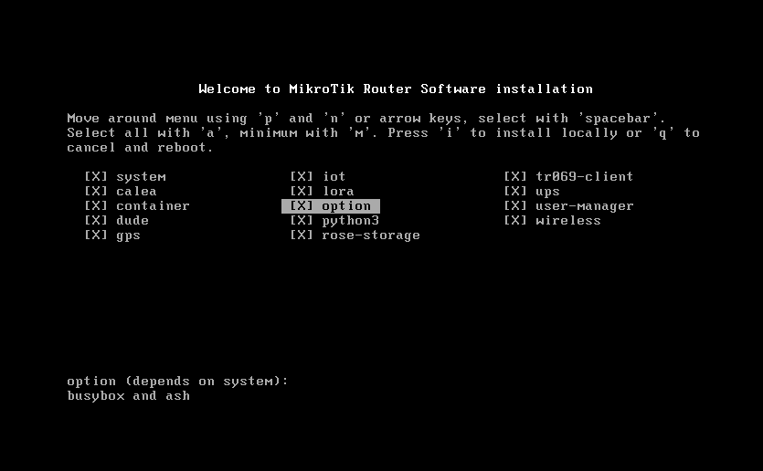
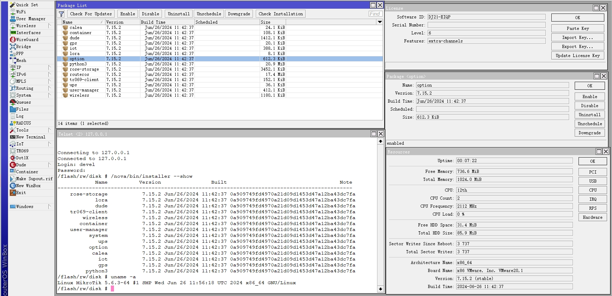
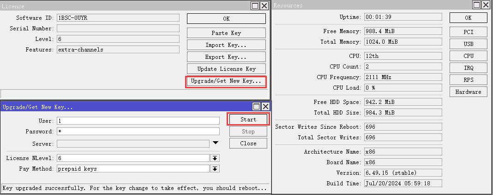
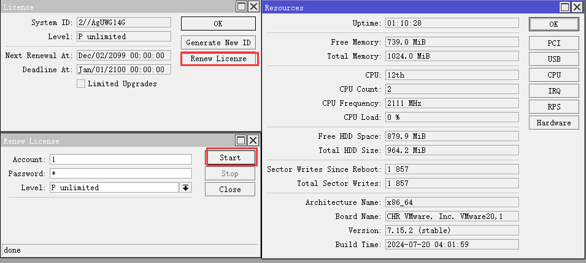
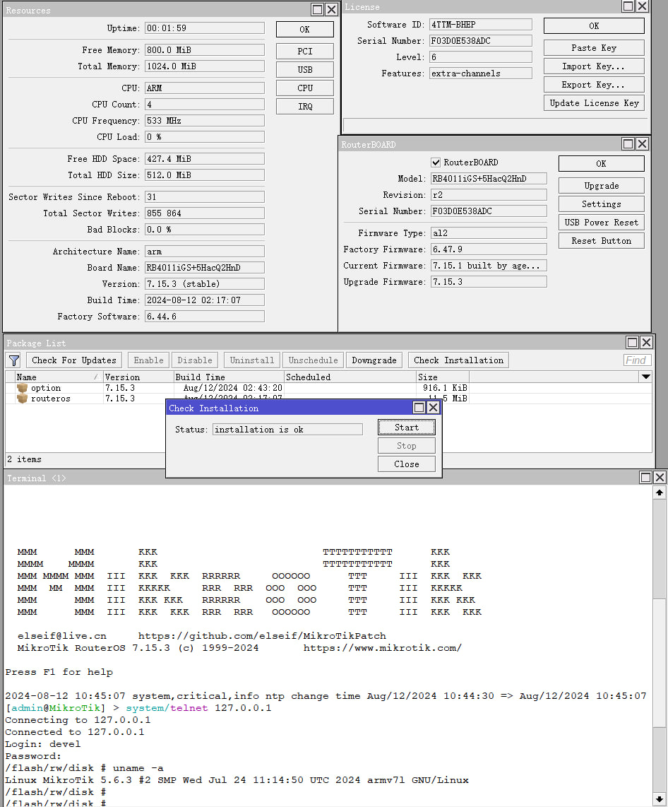
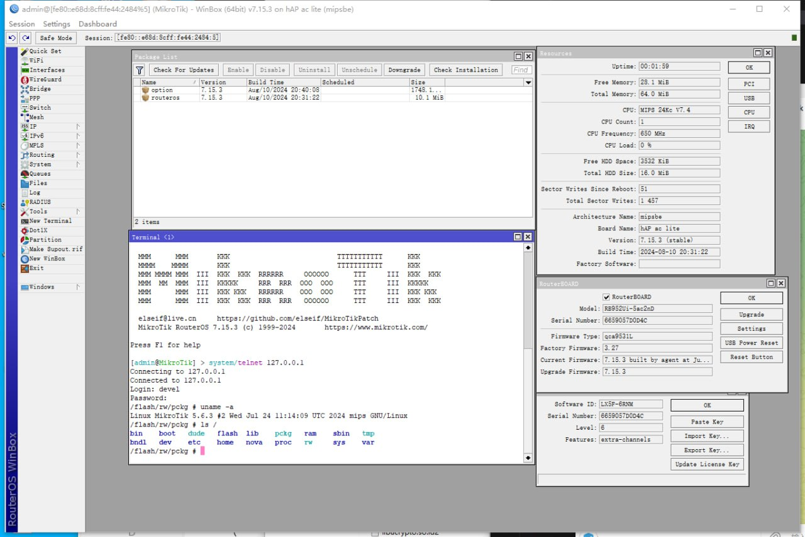

**IMPORTANT:** For **testing purposes only**. Use at your own risk. Production environments require official licenses.

By proceeding, you acknowledge that:
- You have reviewed and comprehend the legal implications and risks involved
- These tools will be used exclusively in non-production, test environments
- Production deployments shall utilize officially licensed software

# MikroTik RouterOS Patch [[中文](README.md)]

### [[Discord](https://discord.gg/keV6MWQFtX)] [[Telegram](https://t.me/mikrotikpatch)] [[Keygen(Telegram Bot)](https://t.me/ROS_Keygen_Bot)]

### Download [Latest Patched](https://github.com/elseif/MikroTikPatch/releases/latest) iso file,install it and enjoy.
### CHR image is both support BIOS and UEFI boot mode.

### Support online upgrade,online license,cloud backup,cloud DDNS

### Renew license for x86 v6.x

### Renew license for chr

## How to use shell
    install option-{version}.npk package
    Enter the shell by executing /sh in the terminal.
## How to license RouterOS
    After installing the option-{version}.npk package, reboot the device. The license will be activated automatically.
    CHR images support online license activation
## How to use python3
    install python3-{version}.npk package
    Enter the shell by executing /sh in the terminal.
    run python -V
### npk.py
    Sign，Verify，Create, Extract npk file.
### patch.py
    Patch public key and sign NPK files
### How to Enable Container Mode Without Physical Reboot
    1. Install the option.npk package.
    2. Open a terminal and run: `system/device-mode/update container=yes`
    3. Open a new terminal and run: `system/shell cmd="reboot -f"`

## all patches are applied automatically with [Github Action](https://github.com/elseif/MikroTikPatch/blob/main/.github/workflows/).

